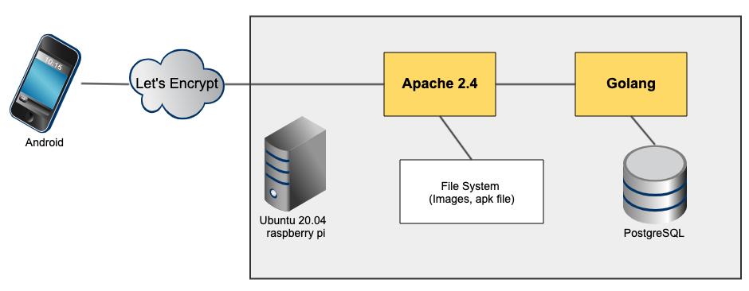
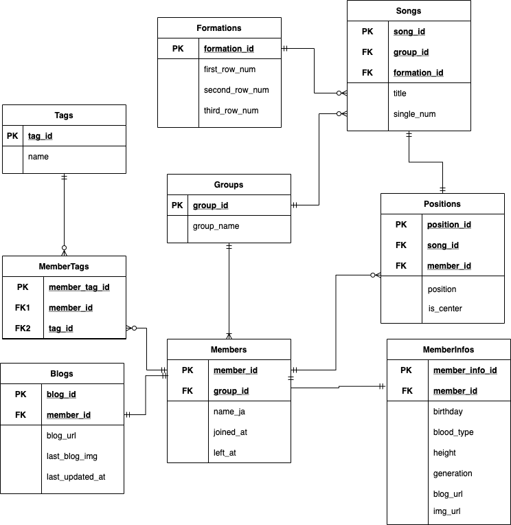

# API server

API server with ubuntu 20.04 on raspberry pi 4

## Tech Stack

-   ubuntu: 20.04
-   apache2: 2.4.41 (Ubuntu)
-   golang: 1.16 linux/arm64
-   postgres: 12.8 (Ubuntu 12.8-0ubuntu0.20.04.1)

## System Architecture



## Database design



## API design

[OpenAPI](./docs/openapi.yaml)

### DB Access (API)

Using test API key

-   https://kokoichi0206.mydns.jp/api/v1/members?gn=nogizaka&key=e3b0c44298fc1c149afbf4c8996fb92427ae41e4649b934ca495991b7852b855
-   https://kokoichi0206.mydns.jp/api/v1/songs?gn=nogizaka&key=e3b0c44298fc1c149afbf4c8996fb92427ae41e4649b934ca495991b7852b855
-   https://kokoichi0206.mydns.jp/api/v1/positions?title=%E3%81%A3%E3%81%A6%E3%81%8B&key=e3b0c44298fc1c149afbf4c8996fb92427ae41e4649b934ca495991b7852b855
-   https://kokoichi0206.mydns.jp/api/v1/formations?gn=hinatazaka&key=e3b0c44298fc1c149afbf4c8996fb92427ae41e4649b934ca495991b7852b855
-   https://kokoichi0206.mydns.jp/api/v1/blogs?gn=nogizaka&key=e3b0c44298fc1c149afbf4c8996fb92427ae41e4649b934ca495991b7852b855

### Face Images

-   https://kokoichi0206.mydns.jp/imgs/nogi/iwamotorenka.jpeg
-   https://kokoichi0206.mydns.jp/imgs/sakura/fujiyoshikarin.jpeg
-   https://kokoichi0206.mydns.jp/imgs/hinata/matsudakonoka.jpeg

### Images of Latest Blogs

-   https://kokoichi0206.mydns.jp/imgs/blog/nogi/endousakura.jpeg
-   https://kokoichi0206.mydns.jp/imgs/blog/sakura/fujiyoshikarin.jpeg
-   https://kokoichi0206.mydns.jp/imgs/blog/hinata/matsudakonoka.jpeg

## Getting Started

```sh
# Setup

## ----- Migration for sqlboiler -----
go install github.com/volatiletech/sqlboiler/v4@v4.11.0
go install github.com/volatiletech/sqlboiler/v4/drivers/sqlboiler-psql@latest

## version が異なると大量の差分が出る可能性があるので、なるべく揃えたい
sqlboiler --version
SQLBoiler v4.13.0
```
